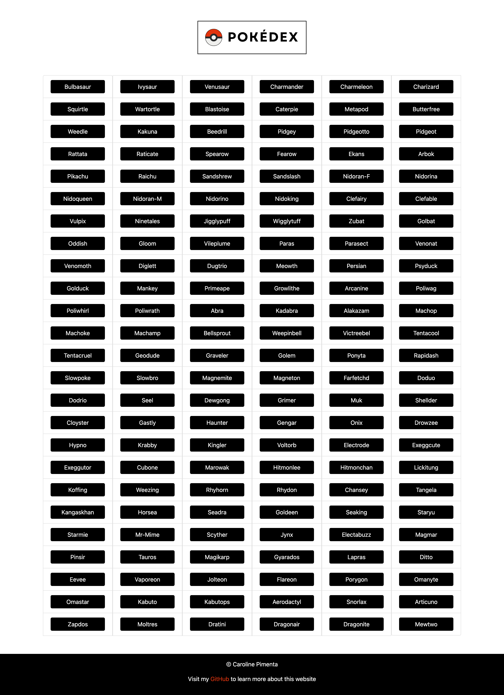

# Pokédex
Pokedex is a small web application built with HTML, CSS, and JavaScript. It loads
data from an external API and enables viewing data points in detail.

## Project context
I built this app as part of my web Development course at CareerFoundry, where we learn programming by building a project.

It was required for the learning process that I used the Bootstrap framework in this project.

## App features
- Load data from an external source (API: https://pokeapi.co/)
- Display the first 150 Pokemons ordered by their ID
- On user action (e.g., by clicking on a list item), display details for that item

## Links
- Repository: https://github.com/pimentacaroline/pokedex
- Deployment: https://pimentacaroline.github.io/pokedex/

## Screenshot

